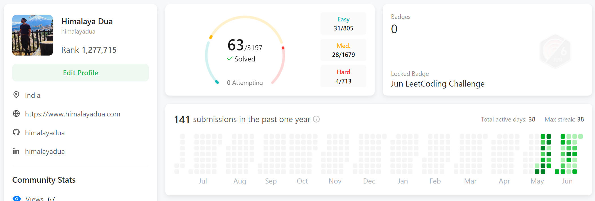

# 20 Concepts to solve LeetCode questions efficiently

Tricks, and algorithm patterns that can help you solve LeetCode questions efficiently
I learned these concepts along my very short journey so far on [leetcode](https://leetcode.com/u/himalayadua/). 

Here's a list of 20 small concepts:
1. [Two Pointers](https://github.com/himalayadua/Neetcode-150/blob/main/Concepts/1.%20Two%20Pointers%20technique.md): Use two pointers to traverse an array or list simultaneously, often used in searching, sorting, or finding subarrays.

2. [Sliding Window](https://github.com/himalayadua/Neetcode-150/blob/main/Concepts/2.%20Sliding%20Window.md): Maintain a window of elements in an array or list and slide it through to find a desired pattern or subarray.

3. [Binary Search](https://github.com/himalayadua/Neetcode-150/blob/main/Concepts/3.%20Binary%20Search.md): Efficiently search a sorted array by repeatedly dividing the search space in half.

4. [Prefix Sum](https://github.com/himalayadua/Neetcode-150/blob/main/Concepts/4.%20Prefix%20Sum.md): Precompute the cumulative sum of elements in an array to efficiently answer range sum queries.

5. [Binary Tree Traversal](https://github.com/himalayadua/Neetcode-150/blob/main/Concepts/5.%20Binary%20Tree%20Traversal.md): Master preorder, inorder, and postorder traversals to solve binary tree-related problems.

6. [Depth-First Search (DFS)](https://github.com/himalayadua/Neetcode-150/blob/main/Concepts/6.%20Depth-First%20Search%20(DFS).md): Traverse through a graph or tree by exploring as far as possible along each branch before backtracking.

7. Breadth-First Search (BFS): Explore all the vertices of a graph or tree level by level, using a queue.

8. Dynamic Programming (DP): Break down a complex problem into smaller subproblems and store their solutions to avoid redundant computations.

9. Memoization: Cache the results of expensive function calls to avoid repetitive calculations in recursive algorithms.

10. Greedy Algorithms: Make locally optimal choices at each step to find an overall optimal solution.

11. Union-Find (Disjoint Set): Maintain disjoint sets and perform union and find operations efficiently, often used in graph algorithms.

12. Topological Sorting: Sort the vertices of a directed acyclic graph (DAG) in a linear order such that for every directed edge uv, vertex u comes before v.

13. Backtracking: Generate all possible solutions by incrementally building a solution candidate and undoing choices when they lead to a dead end.

14. Bit Manipulation: Perform operations on individual bits to solve problems efficiently, such as bitwise XOR, AND, OR, and shifting.

15. Sorting Algorithms: Master efficient sorting algorithms like Quicksort, Mergesort, and Heapsort.

16. Hashing: Use hash functions to map data to a fixed-size array, enabling efficient data retrieval and storage.

17. Graph Algorithms: Familiarize yourself with common graph algorithms like Dijkstra's algorithm, Bellman-Ford, and Floyd-Warshall.

18. String Manipulation: Learn various string operations like substring search, string reversal, anagram detection, and palindrome checking.

19. Bitmasking: Use bitwise operations to store and manipulate boolean states compactly, often used in combinatorial problems.

20. Divide and Conquer: Break down a problem into smaller, independent subproblems, solve them recursively, and combine the results.

