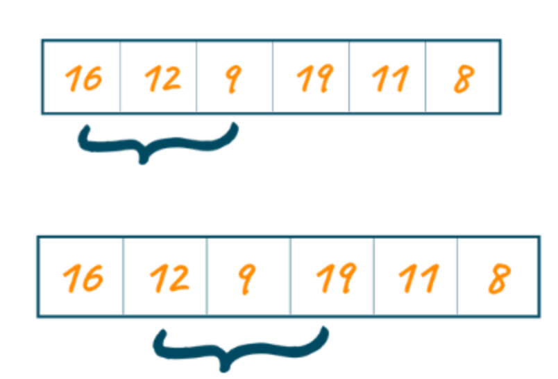

# Sliding Window
The Sliding Window technique 
- used to solve problems that involve finding subarrays or sublists that satisfy certain conditions
- involves maintaining a window of elements within a larger array 
- and sliding the window through the data structure 

**Types**
1. Fixed Window Size
2. Dynamic Window Size

To understand if a question can be solved using the Sliding Window technique, look for the following characteristics:
- Subarray or Sublist Requirement
    - problem involves finding a contiguous subarray or sublist 
    - that satisfies a specific condition
        - such as having a certain sum, length, or meeting certain constraints.
- Sequential or Continuous Nature
    - elements in the subarray or sublist must be sequential or continuous 

## Let's consider an example problem: 
**"Given an array of positive integers and a target sum, find the minimum length of a subarray whose sum is greater than or equal to the target sum."**

To solve this problem using the Sliding Window technique:

1. Initialize two pointers, "left" and "right," both pointing to the start of the array.

2. Initialize variables for the 
    - minimum length, 
    - current sum, and 
    - a flag to track if a valid subarray has been found.
    - this is a `dynamic window problem`
        - subarray length not mentioned
3. While the right pointer is within the array bounds, do the following:
   a. Add the value at the right pointer to the current sum.
   b. While the current sum is greater than or equal to the target sum, do the following:
      - Update the minimum length if necessary.
      - Subtract the value at the left pointer from the current sum.
      - Move the left pointer to the right.
   c. Move the right pointer to the right.
4. After the loop ends, if a valid subarray was found, return the minimum length; otherwise, return 0 or the appropriate indicator for no valid subarray.

## Identify if a problem can be solved using the Sliding Window technique
To identify the key characteristics of a problem that make it suitable for the Sliding Window approach, consider the following aspects:

- Subarray or Sublist Requirement
    - problems that involve finding a contiguous subarray or sublist that satisfies a specific condition

## Common pitfalls to watch out for
Being aware of these pitfalls will help you avoid mistakes and ensure a correct and efficient implementation. Here are some key pitfalls to keep in mind:
- Incorrect Window Size or Initialization
- Improper Window Movement
    - Carefully define the conditions for moving or sliding the window
- Handling Edge Cases
    - Be mindful of edge cases such as empty arrays or lists, single-element structures, or scenarios where the window size exceeds the array's length
- Handling Multiple Pointers
    - Some problems may require multiple pointers or indices to track different positions within the window. 
    - Ensure that you manage these pointers correctly and update them appropriately during the window movement
