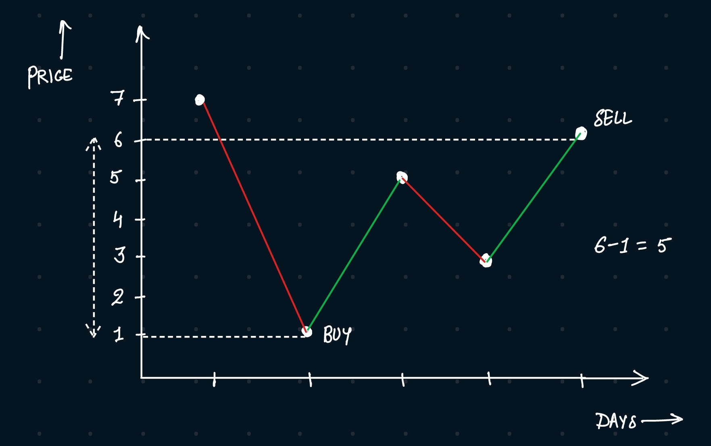

# Solution:
Think:
- Buy Low, Sell High
- question language:
    - choosing a single day to buy one stock 
    - and choosing a different day in the future to sell
- example
    - [7,1,5,3,6,4]
    - greatest number = 7
    - greatest number we are interested in = 6
- we have to assume
    - for i in array
    - i = days
    - if you buy at i=2
    - you can't sell at i=1

## Solve
Two pointers:
- L and R
    - L = day1
    - R = day2
- currentMax = 0
- buy on L & sell on R
- if R < L
    - move L & R to right
        - L++
        - R++
    - L = day2
    - R = day3
- if R > L
    - if R-L > currentMax
        - currentMax = R - L
    - L: don't change
    - R++

